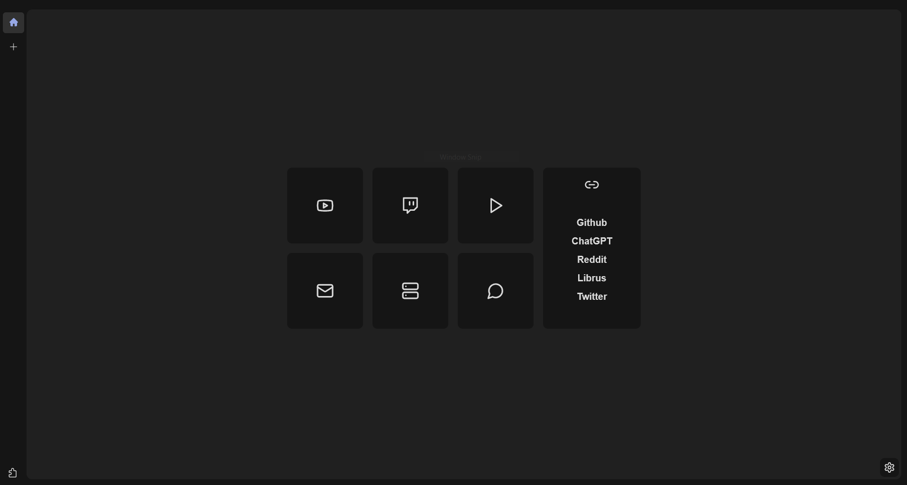
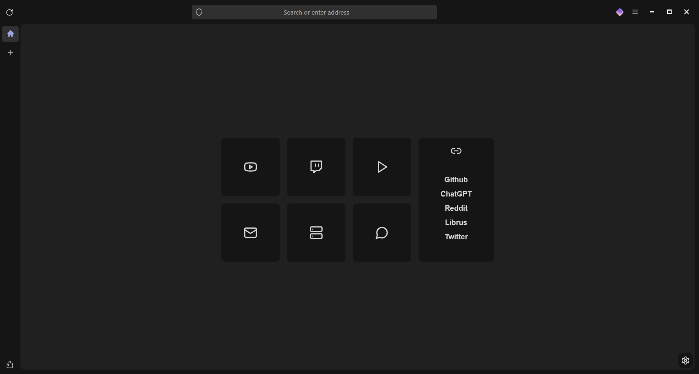
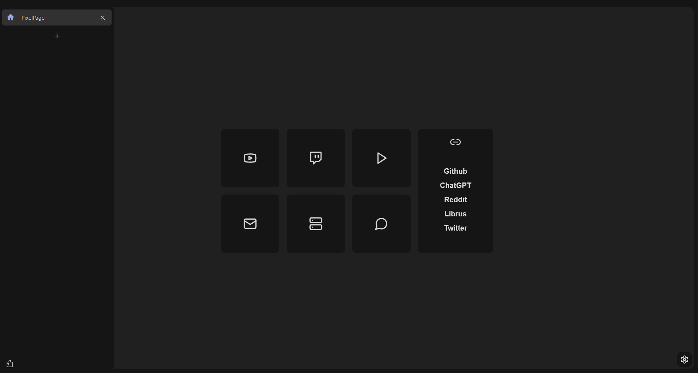
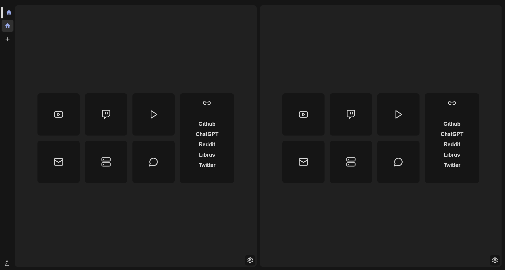

### Arctic Floorp is a Theme for the [Floorp](https://floorp.app/en) browser, inspired by the Arc browser.

## Screenshots

> Extension used for the homepage is [PixelPage 2.0](https://github.com/Trzynastek/PixelPage2.0).

	
	
	
	
	

## Installing

> **To make the process easier DO NOT restart the browser untill the end.**

1. Install Floorp browser (Obviously).
2. Go to `about:profiles` page.
3. Press "Open Folder" button found in he Root Directory under the default-release profile.
4. Move chrome folder found in Arctic Floorp files to the profile directory.
5. Go to browser settings > Design.
6. Set "Tab Bar Style" to "Vertical Tab Bar", enable: 

		"Collapse Vertical Tab Bar", 
		"Show the Open a new tab button inside Vertical Tab Bar".
8. Go to browser settings > Design > Lepton Settings.
9. Choose "Use Photon design".
10. Under "Automatically hide browser elements" enable: 
	
		"Automatically hide back button", 
		"Automatically hide forward button", 
		"Automatically hide buttons on the Address Bar".
		
11. Under "Manage browser elements" enable: 

		"Hide Sidebar Headers", 
		"Hide Address Bar icons", 
		"Hide Bookmarks Bar icons", 
		"Hide Bookmarks Bar labels", 
		"Hide disabled context menu items".
		
12. Under "Manage browser elements" disable: 

		"Enable Lepton's context menu icons"
		
13. Under "Position adjustments" enable: 

		"Center text in the Address Bar".
	
14. Go to browser settings > Browser Manager Sidebar 
15. Disable "Show the Browser Manager Sidebar".
16. Right-click on the toolbar (Where the URL input is located) and press "Customize Toolbar..."
17. Remove the following items: 

	    "List all tabs",
    	"Floorp View",
    	"Reopen closed tab",
    	"Show Sidebars on the other side," 
    	"Firefox account", "Profile Manager".

18. Press "Done".
19. Press "CTRL + SHIFT + B".
20. Go to browser settings > Search.
21. Uncheck every option under "Search Shortcuts".
22. Download the [Firefox Color](https://addons.mozilla.org/en-US/firefox/addon/firefox-color/) extension.
23. In the Firefox Color configurator set the following HEX colors: 

	    Toolbar Color: 151515, 
	    Background Color: 151515, 
	    Search Bar Color: 303030, 
	    Tab Highlight Color: D9D9D9, 
	    Popup Text: D9D9D9, 
	    Toolbar Icons and Text: D9D9D9, 
	    Background Tab Text Color: AFAFAF, 
	    Search Text: D9D9D9, 
	    Popup Background: 151515.

24. Save the theme.
25. Restart the browser.

I also recommend setting shortcuts for the Split View like this:

    Open current tab on right in split view: F1
    Close split view: Alt + F1

Settings for this can be found under browser settings > Keyboard Shortcuts > Split View Actions.
